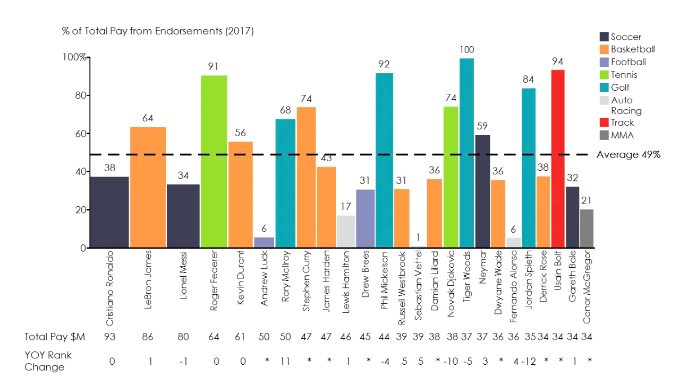
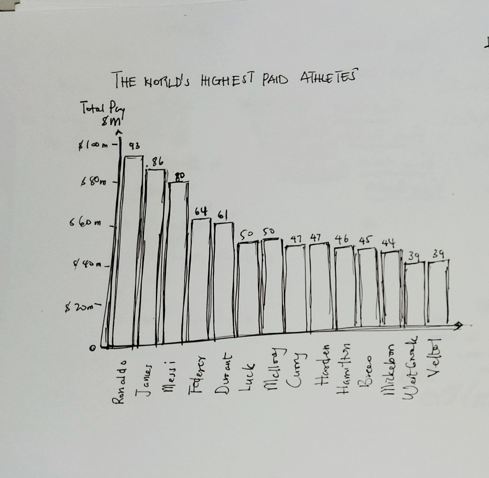
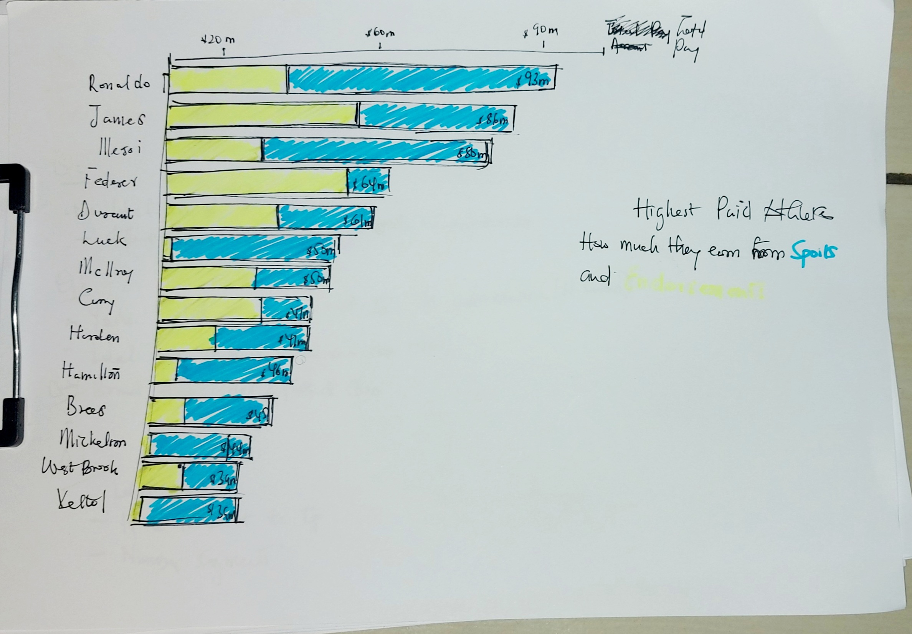

# Highest Paid Athletes in 2017
We often watch sports for recreational reasons. With so much passion imbued in sports, we go through a roller coaster of emotions when our teams win or lose or when a player we love moves from one team to another. In as much as we feel one with the team and entitled to explanations, we often overlook what really drives the industry - money. This chart looks at the highest paid players in the sports industry, looking at what percentage of their money comes from endorsements and their sports itself.

You can find the chart [here](https://www.mekkographics.com/the-worlds-highest-paid-athletes/)

Below is the chart that was redesigned.
 
  

### Redesign Process
##### Initial Analysis
The first step was to look at the original chart and try and understand the information that was being portrayed. I tried to figure out what was being expressed and wrote down things I found confusing.
I proceeded to understand exactly who the audience of this chart was for and then listed down some things I might change or do differently.

The main chart displays this information through a vertical bar graph. The height of each bar is the percentage of an athlete's salary that comes from endorsement and the width of the bar depicts the total amount. Each bar is colored according to the player's sport domain. The chart includes other things like the YOY Rank. I found the representation rather confusing and busy. Being that the chart itself just wanted to display the salaries of the highest paid players, I believe there were some areas of the chart that could be improved.

##### Evaluation
After this I used a critique method to understand the effectiveness profile of the chart. It basically evaluates the chart on two fronts, from an emotive and informative point of view.
Emotive factors look at:
1. Aesthetics
2. Engagement

Informative look at:
1. Completeness
2. Usefulness
3. Perceptibility
4. Truthfulness
5. Intuitiveness.

You can find the metric [here](http://www.perceptualedge.com/articles/visual_business_intelligence/data_visualization_effectiveness_profile.pdf)

I realised from critique method the chart, though slightly informative, lacked much in on the emotive side. It had the right information and the represented it well, however lables,data on the y-axis, added information and the choice of chart made it hard to process the information the chart attempted to explain.
Hence I focused primarily on trying to remove clutter from the graph and improve it's clarity by a few tweaks in what to display on the y-axis and in the chart used.

##### Wireframing
After this, I proceeded to wire frame my ideas of what I thought would make clear exactly what the initial graph was trying to portray. I took the initial analysis I had done and decided to implement the things I said I would change. I took out a few things the initial chart had because I thought they were not integral to the chart's expression of information.
I did this on pen and paper. After a first iteration of my idea, I personally critiqued it and asked myself the same questions I did the main chart. I took that feedback and went into a second iteration and did the same with a third iteration.
My process was built around, "Does it make sense to me first?". You can find the initial iterations below:

1. Prototype 1
 

2. Refined Prototype
 

##### Testing
I tested my prototypes with users to get their perspective on my redesign. I got very helpful comments to which I integrated into my final solution. Some of the comments resonated around:
1. How my title related to my chart and the position of my title
2. How I was comparing the two contributors of athlete's pay(endorsements and sports)
3. The intervals on the x-axis
4. A lack of labeling on the y-axis

Based off this feedback, I incorporated the insight I had gained from users and with a few tweaks, came up with a better final solution, which had more clarity.
The feedback did not call for any major change in my visualization, however it did require me to change my labels and the intervals on my axis. I also slightly changed the way I was comparing the two categories.

##### Final Solution

My final solution shows a graph of how endorsements and sports contribute to the salaries of highest paid athletes in 2017. I chose a horizontal stacked bar graph because it was more intuitive reading the athlete's names and their respective salaries. The stacked bar helped properly display which parts of the total salary came from endorsements and sports. I took out the sports categorization and YOY Rank because they only added clutter to the chart.

Find the chart below:

