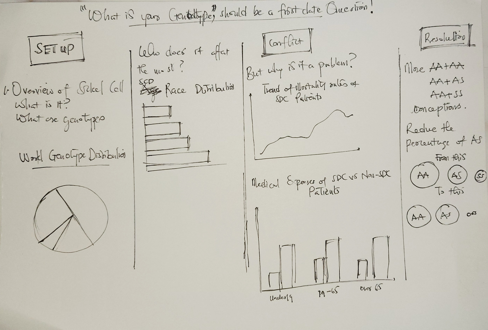

A genotype is the entire genetic constitution of an individual with reference to a single trait, set of traits, or an entire complex of traits.
There are four hemoglobin genotypes (hemoglobin pairs/formations) in humans: AA, AS, SS and AC.

SS and AC are the abnormal genotypes or the sickle cells.

Sickle cell disease(SCD) is an inherited blood disorder. It is marked by flawed hemoglobin. That’s the protein in red blood cells that carries oxygen to the tissues of the body. So, sickle cell disease interferes with the delivery of oxygen to the tissues.

Individuals with sickle cells experience severe pains in body parts where oxygen flow is compromised due to blockage in the blood vessels.

Sickle cell is an inherited disease caused by a defect in a gene.

- A person will be born with sickle cell disease only if two genes are inherited—one from the mother and one from the father.
- A person who inherits just one gene is healthy and said to be a "carrier" of the disease. A carrier has an increased chance of having a child with sickle cell disease if he or she has a child with another carrier.

 
### Outline of my Project

##### What's the situation?
Blindly entering a partnership could lead to giving birth to a child with an SS hemoglobin genotype. Partners who may be SS and AS or AS and AS have the probability of giving birth to a child who may be sickle cell patient.
##### Why now?
SCD's mortality rate, though reduced over the years, is quite high if not managed. The medical bills that accompany management it are fairly high making it a difficult diseases to outmaneuver through
##### What's my message?
Knowing each others genotype before getting into a serious relationship can prevent severe loss down the line.

[Check out the Part 2 of this Project](https://jnrkufuor.github.io/kufuor-portfolio/final_project_ErnestKufuor_2/)

[Check out the Part 3 of this Project](https://jnrkufuor.github.io/kufuor-portfolio/final_project_ErnestKufuor_3/)

### Initial Sketches
This initial sketch captures a top level view of the flow of information from start to end.
 

### Data
1. [Centre for Disease Control and prevention](https://www.cdc.gov/ncbddd/sicklecell/data.html)
   This data would be primarily used to shed light on the distribution of sickle cell disease(SCD) patients and non-SCD patients.
   
   Supplementary Data: [Infographic](http://www.scdcoalition.org/pdfs/ASH_Infographic.pdf)
2. [SCD Race Distribution Data]({{ site.baseurl }}/assets/data/race_distribution_michigan_1997-2014.csv)
   This would be used to explain how sickle cell is distributed among different races to understand if there is a prevalence in any of the races.
3. [SCD Medical Costs Data]({{ site.baseurl }}/assets/data/medical_costs_SDC_US.csv)
   This would be used to draw a side by side bar graph of the medical expenses of SCD patients.
4. [SCD US Death Trend Data]({{ site.baseurl }}/assets/data/death_trend_US_SDC.csv)
   This would be used to create a line graph to understand the mortality rate of SCD patients over the years.

### Medium
The project would go three three major stages:
##### Brainstorming and Prototyping
The initial phases of the project would constitute paper sketches,testing, exploration and brainstorming. The goal here is to ideate on the best ways to present the data and then run it by users to check whether my representation is clear enough. Paper sketches would suffice in this phase.
##### Building the Graphs
Once robust solutions have been designed, the next phase is to build my graphs with the data at hand. I would use Tableau to build the graphs.
##### Presentation
This would be completed in Shorthand. My objective is to tell a story with my data and Shorthand offers a good functionality to achieve this.
