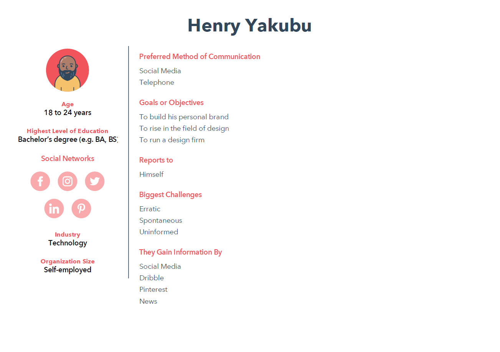

A genotype is the entire genetic constitution of an individual with reference to a single trait, set of traits, or an entire complex of traits.
There are four haemoglobin genotypes (haemoglobin pairs/formations) in humans: AA, AS, SS and AC.

SS and AC are the abnormal genotypes or the sickle cells.

Sickle cell disease (SCD) is an inherited blood disorder. It is marked by flawed haemoglobin. That is the protein in red blood cells that carries oxygen to the tissues of the body. So, sickle cell disease interferes with the delivery of oxygen to the tissues.

Individuals with sickle cells experience severe pains in body parts where oxygen flow is compromised due to blockage in the blood vessels.

Sickle cell is an inherited disease caused by a defect in a gene.

- A person will be born with sickle cell disease only if two genes are inherited—one from the mother and one from the father.
- A person who inherits just one gene is healthy and said to be a "carrier" of the disease. A carrier has an increased chance of having a child with sickle cell disease if he or she has a child with another carrier.

 
### Outline of my Project

##### What's the situation?
Blindly entering a partnership could lead to giving birth to a child with an SS haemoglobin genotype. Partners who may be SS and AS or AS and AS have the probability of giving birth to a child who may be sickle cell patient.
##### Why now?
SCD's mortality rate, though reduced over the years, is quite high if not managed. The medical bills that accompany management it is fairly high making it a difficult disease to outmanoeuvre through.
##### What's my message?
Knowing each other’s genotype before getting into a serious relationship can prevent severe loss down the line.

### Persona
My personas were conceptual constructs of how I viewed my users. They really helped me shape the format and delivery of my story. They also helped me figure out the demographic of people to reach out to for user interviews. The key areas for me while creating my personas were their knowledge scope, means of attaining information and their relationship status. You can find my personas below:

- [Henry Yakubu](../assets/data/Henry%20Yakubu.pdf)
 
- [Ruth Cortez](../assets/data/Ruth%20Cortez%20(2).pdf)
 

### Mood board
My mood board helped me gather the necessary inspiration on how to present my data and how to structure it. You can find a link to my mood board [here](https://www.pinterest.com/jaykufuor/sickle-cell/).

### Storyboard
After deliberation and prototyping, I developed my storyboard. My storyboard outlined the flow of my information from section to section. It was based off my outline and inspiration from mood board. A snippet of it can be found below. A link to the storyboard is [here](../assets/data/SCD%20-%20Storyboard.pdf)
 

### User research and Interviews
The next step was to assess how good my storyboard conveyed the story I was trying to tell. I came up with a user research protocol to help guide my research process. 

##### Target Audience
My persona really embodied who my target audience were. I was hoping to reach people who were looking to get into any relationship whatsoever and have children. This constituted people between the ages of 18 and 35 years.

##### Identifying individuals 
To identify individuals to interview, I typically talked to people on campus and at work. The people that really mattered were individuals who were not married but had the hopes of some day. I talked to individuals about my project and asked them if they would be interested to have a short interview.

##### Interview Script
My interview script tried to capture three things: demographics on the user, their sentiments to my story, and their honest feedback on the work itself. The question I asked are below:

1. How old are you?
2. What is your gender?
3. What is your highest level of education?
4. Are you married?
5. Do you have any experience with data visualization?
6. Did you have any prior knowledge on the sickle cell disease?
7. What was your first impression when you looked at the story board?
8. What do you think is the purpose of the project?
9. What do you think is the main takeaway of this story?
10. What worked for you on the storyboard? Why?
11. Did you find anything interesting? Why?
12. Did you find anything confusing?
13. What do you think can be improved?

##### Findings 
I got a lot of decent input from the interviews, some which made me rethink the whole dynamics of how I was representing data. 

- The tree map I used to show proportion data was uncommon and a pie chart would be more identifiable.
- Referring to graphs or putting them side by side would make my story much more cohesive.
- The font and colour scheme of the storyboard really aided in the experience.
- The titles for some of the graphs were either not clear or depicted a different message from what the graphs were showing
- Some medical terms used in the article were unfamiliar and perhaps context may help.
- The call to action was a bit too wordy.
- Make the data more inclusive of other regions of the world.
- Two-axes graphs are hard to read. Consider separating or normalizing in some format.
- Preambles may go a long way in helping guide the reader’s attention.
- Compare the death rate of sickle cell patients to the medical costs. 

##### Changes
The feedback I got was very solid and I plan to incorporate most of them into my newer version because all my interviews pointed out the same things. I intend to ...

1. Change the tree map to a pie chart.
2. Rename the titles of charts to depict fully what is happening within the graphs.
3. Increase the font and size of some graphs.
4. Write a preamble to each section that would help guide the readers thoughts.
5. Compare the death rate of sickle cell patients to the medical costs, but not on the same graph. I will do this and two side by side graphs.
6. Take out the two-axes graph.
7. Reword the call to action and make it more picturesque to reduce the work on the user. 

