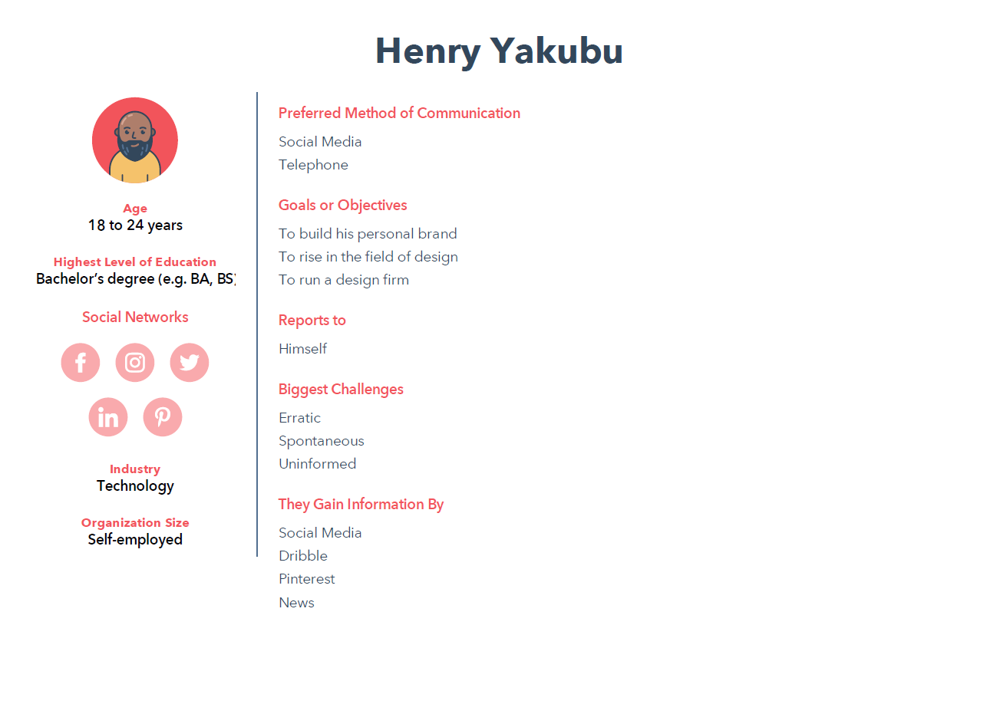
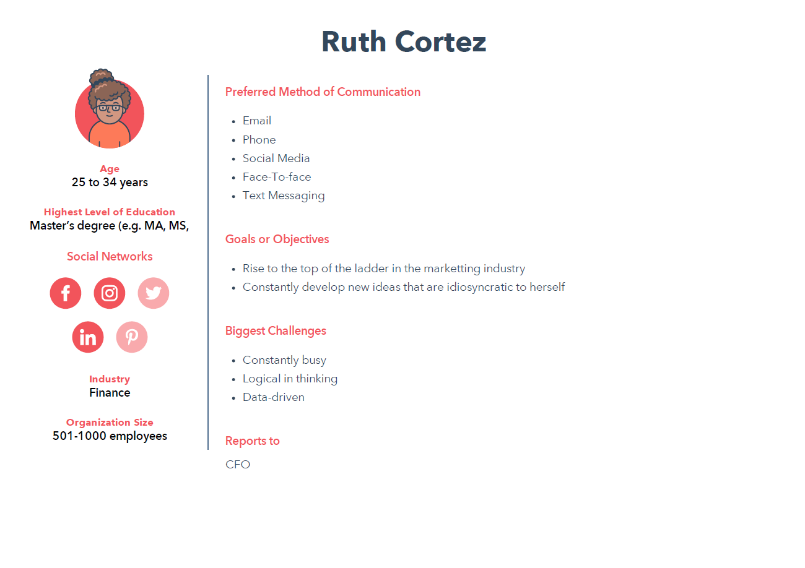

A genotype is the entire genetic constitution of an individual with reference to a single trait, set of traits, or an entire complex of traits.
There are four haemoglobin genotypes (haemoglobin pairs/formations) in humans: AA, AS, SS and AC.

SS and AC are the abnormal genotypes or the sickle cells.

Sickle cell disease (SCD) is an inherited blood disorder. It is marked by flawed haemoglobin. That is the protein in red blood cells that carries oxygen to the tissues of the body. So, sickle cell disease interferes with the delivery of oxygen to the tissues.

Individuals with sickle cells experience severe pains in body parts where oxygen flow is compromised due to blockage in the blood vessels.

Sickle cell is an inherited disease caused by a defect in a gene.

- A person will be born with sickle cell disease only if two genes are inherited—one from the mother and one from the father.
- A person who inherits just one gene is healthy and said to be a "carrier" of the disease. A carrier has an increased chance of having a child with sickle cell disease if he or she has a child with another carrier.

 
### Outline of my Project

##### What's the situation?
Blindly entering a partnership could lead to giving birth to a child with an SS haemoglobin genotype. Partners who may be SS and AS or AS and AS have the probability of giving birth to a child who may be sickle cell patient.
##### Why now?
SCD's mortality rate, though reduced over the years, is quite high if not managed. The medical bills that accompany management it is fairly high making it a difficult disease to outmanoeuvre through.
##### What's my message?
Knowing each other’s genotype before getting into a serious relationship can prevent severe loss down the line.

[Check out the Part 1 of this Project](https://jnrkufuor.github.io/kufuor-portfolio/final_project_ErnestKufuor/)

[Check out the Part 2 of this Project](https://jnrkufuor.github.io/kufuor-portfolio/final_project_ErnestKufuor_2/)

### The Final Story

#### The Process
The feedback I got from user interviews in Part 2 helped me figure out what the final story should look like.
I recognized my audience as people young adults who were looking to get into a relationship. My personas really helped with this. Find them below:

- [Henry Yakubu](../assets/data/Henry%20Yakubu.pdf)
 
- [Ruth Cortez](../assets/data/Ruth%20Cortez%20(2).pdf)
 

Most of my interviewees stated that seeing the actual figures and proportions would be something they would like to see. They also stated that creating an emotional piece that creates tension or forces them to be empathetic. This feedback really informed how i curated my story.

A few comments from my interviewees hinted at my data not being representative of the whole world and hence I decided to tell my story from a global perspective but then narrow it down to the United States, since that was where most of the available data came from. I then ended the story from a global perspective again. This dynamic slightly changed how I had planned my initial story to go, though it was worth it.

My storyboard was the backbone of my final piece and really made everything easier. I basically just followed it and made necessary changes when I needed to. 

#### Design Choices
I had a lot of good feedback on the colours that I had chosen. I chose coral, shades of grey and a orient as my colours. I tried to keep things clean by using a white background. The goal was to make people focus more on the story being told than all the gimmicks that came with iridescence and animations. To transition between arcs, I used light grey callouts with large text to catch attention and help the user transition to the next part of my story. For the beginning and closing chapters I used rather very deep shades of grey to hint at there being boundary points in my design, as I did not use these colours anywhere else. 

#### Changes
From Part 2, I had a few changes that I wanted to go through based off user feedback. Not everything was changed but all the feedback was incorporated one way or another.

1. Change the tree map to a pie chart.
   I implemented this change as it made things clearer and used a more familiar graphic that users were comfortable with.
2. Rename the titles of charts to depict fully what is happening within the graphs.
   I renamed the titles for all my charts. I realized that they were too formal, hence I changed them to add a bit more essence and emotion to the story I was telling.
3. Increase the font and size of some graphs.
   I tried to scale all graphs to be around the same size and be visually noticeable. 
4. Write a preamble to each section that would help guide the readers thoughts.
   Preambles really became the linking factors to each piece of my story. I used them to introduce new ideas or transitions from one arc to another. 
5. Compare the death rate of sickle cell patients to the medical costs, but not on the same graph. I will do this and two side by side graphs.
   The data available did not permit me to do this. I did try putting them on the same graph, but It looked messy. What I resorted to juxtaposing both graphs side by side. I slightly changed the medical costs graph to only show the total amount because there was too much noise visually by putting both charts side by side. 
6. Take out the two-axes graph (age and death trend)
   I separated the two graphs and changed the whole dynamic of the age graph. This helped me realize a new way to interpret the data. 
7. Reword the call to action and make it more picturesque to reduce the work on the user. 
   I slightly reworded the call to action. I did not completely change it because I felt it started losing a lot of information as the text started to reduce. I did make it slightly more picturesque to bolster its visual appeal.

#### Lessons
I think the biggest lesson I learnt from this process is that perceptions go a long way in design interpretation. I showed my final design to a few people for feedback and they clearly understood it. This was only possible by virtue of the interviews I had done with like-minded individuals. 

I heard certain comments like, "Wow", "Oh snap" and the likes as they read the story and I realized they were in tune with it. A constant colour scheme helps the user stay in one mind and visualizations help the user see exactly what you want them to see. I found that to be very helpful.

[Check out the Final Piece of this Project on Shorthand](https://carnegiemellon.shorthandstories.com/do-you-know-your-sickle-cell-status-/index.html)
